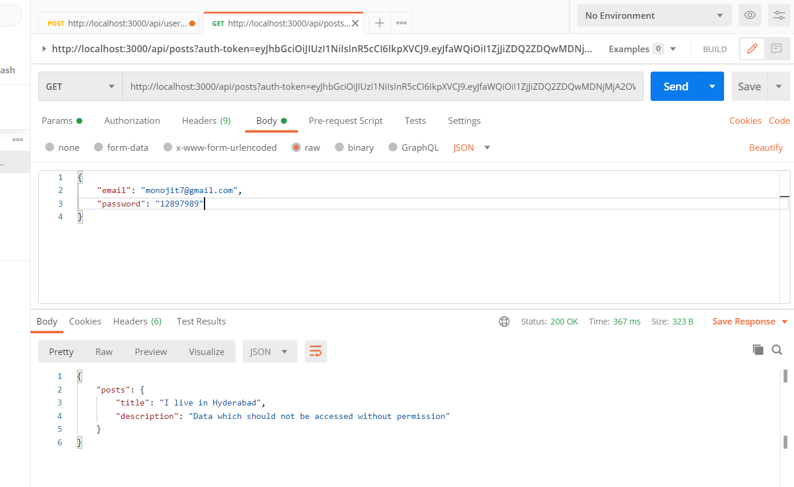

# User-authentication-using-node.js-api-and-JWT
A user authentication system which can be used in any application. Mongodb is used as our database to store user credentials, Node.js REST api for user data validation and verification and to connect to our express server, bcryptjs to encrypt user passwords and jwt for providing security tokens to users who are already logged in, this token lets the user to easily login and view their data without typing password after registration.

## Download this repo :
 

## All the below mentioned snippets need to be executed in command prompt from the directory where this repo is cloned.

 (1) Run `npm install`
        
 Refer this website if you don't have npm and node.js installed in your system :- https://www.npmjs.com/get-npm
    
 (2) Run `npm install express`
        
 Refer this website :- https://www.npmjs.com/package/express
    
 (3) Run `npm install -g nodemon`
        
 Refer this website :- https://www.npmjs.com/package/nodemon
    
 (4) Run `npm install jsonwebtoken`
        
 Refer this website :- https://www.npmjs.com/package/jsonwebtoken
 
 (4) Run `npm install bcryptjs`
        

## Download postman: https://www.postman.com/
Postman is used to run the api.

From the directory where this repo is saved run `npm start`

 
A few configurations need to be made in Postman

* Just above the params it should be set to POST
* In the Headers section, the `KEY` and the `VALUE` should be set exactly as shown in the image below

* During user registration address should be set as `http://localhost:3000/api/user/register`
* User data need to sent in JSON format as shown below

* After sending data will appear in the following format

* During user login address should be set as `http://localhost:3000/api/user/login`
* When the user logs in user data is displayed as follows

